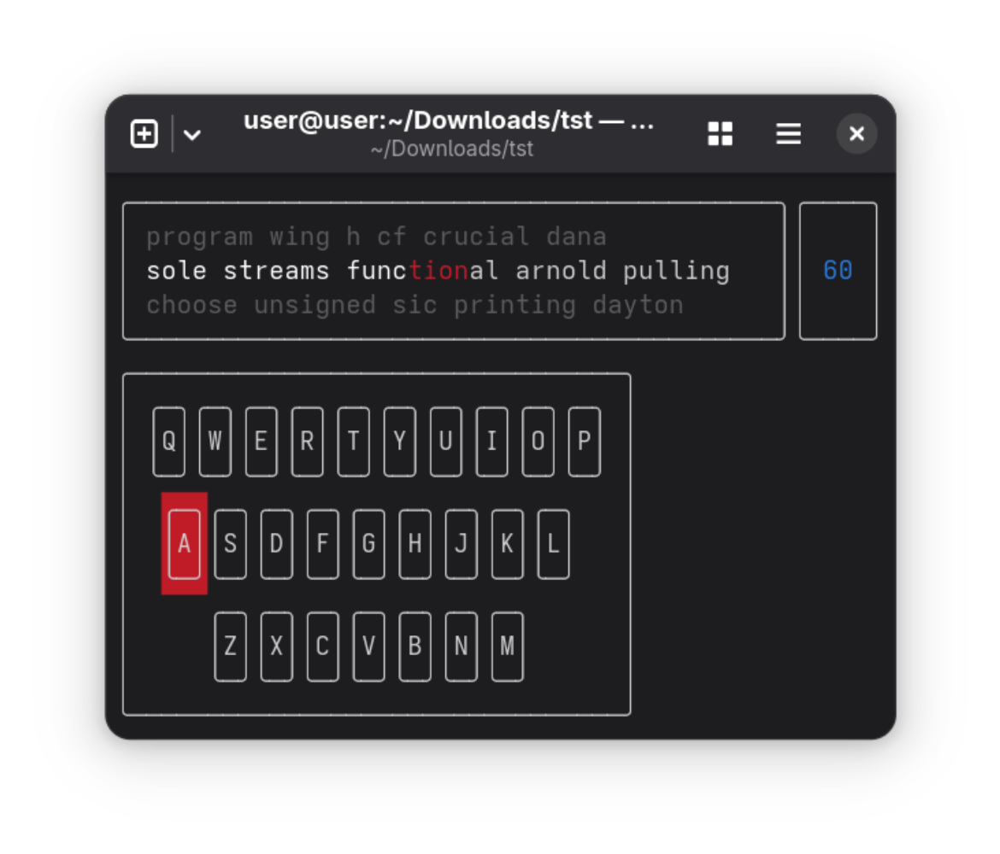

# Typing speed test

A typing speed test game, now in your terminal!



# Installition

### Dependencies

#### Ubuntu

```
sudo apt install libftxui-dev
```

#### Arch

```
yay -S ftxui
```

#### Fedora

```
sudo dnf install ftxui-devel
```

## Compiling

```
meson setup build/release -Dbuildtype=release
meson compile -C build/release
```

# Usage

Pass a file to the application as an argument and it'll be used as the dictionary for building the words for the game. Each word should be separated by a line break.

```
./build/release/typing-speed-test google-10000-english-usa.txt
```
